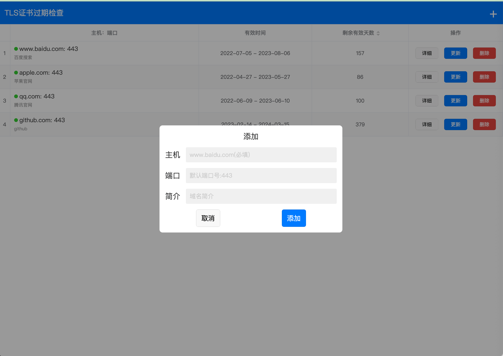

# CertCheck
https证书过期检查

TLS/SSL Certificate expiration check  

#### 使用

1、安装node，启动接口服务

```shell
> cd cert-server
> node cert_info.js
```


2、安装IDE [HBuilderX](https://www.dcloud.io/hbuilderx.html)，导入工程cert-app，点击运行到Chrome


3、预览localhost:3000

